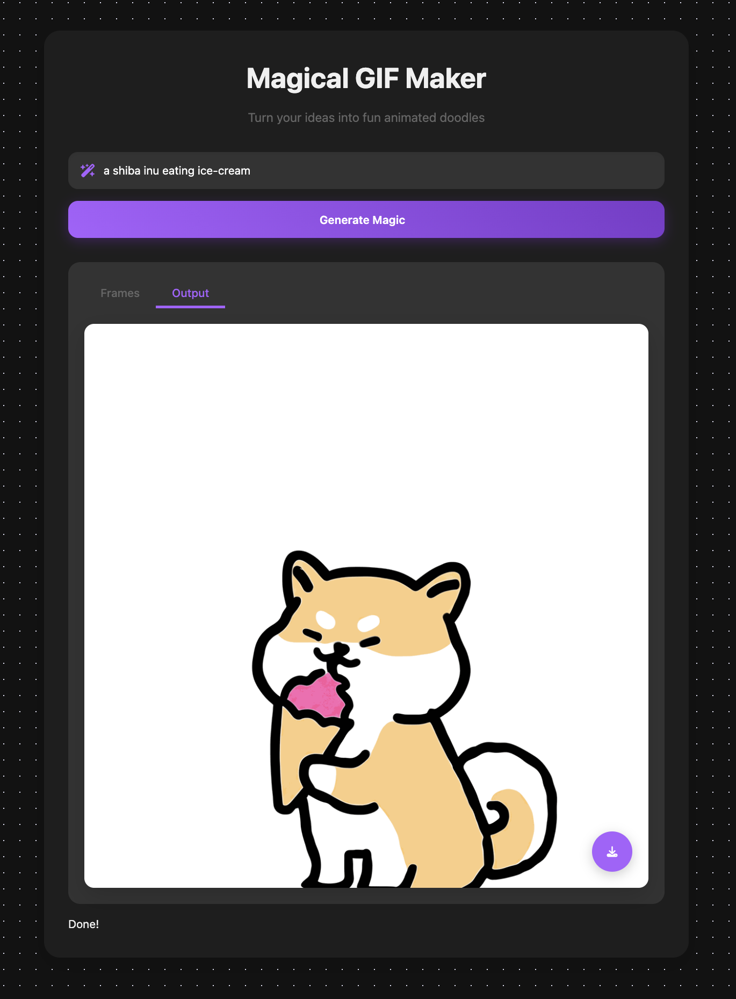
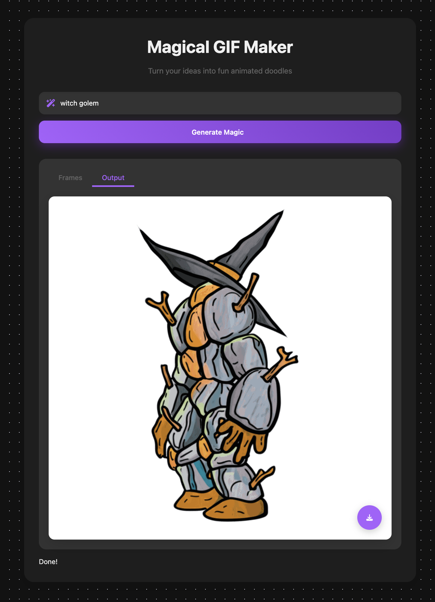
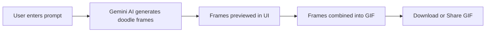

> AI-powered app to generate, edit, and share GIFs from text prompts with a modern UI.

<!-- Badges -->
<p align="center">
  
  
  
</p>

<!-- ASCII Logo -->
<p align="center">
  
</p>

<h1 align="center">🎬 GIFMaker AI Studio</h1>
<p align="center"><b>Turn your ideas into magical animated doodles with the power of AI!</b></p>

---

## ✨ Features

<div align="center">

| 🚀 | **AI GIF Creation** | Generate GIFs from text prompts using Gemini AI |
|----|--------------------|------------------------------------------------|
| 🎨 | **Edit & Customize** | Crop, resize, add captions, and apply filters  |
| 👀 | **Instant Preview**  | See your GIFs update in real-time as you edit  |
| 📤 | **Easy Sharing**     | Download or share your creations instantly     |
| 💎 | **Modern UI**        | Responsive, intuitive, and beautiful interface |

</div>

---

## 🖼️ Screenshots

<div align="center">
  
  
  <br/>
  <em>Gallery: Main interface and generated GIF output</em>
</div>

---

## 🌀 How it Works



---

## 🚀 Getting Started

### Prerequisites

- [Node.js](https://nodejs.org/) (v16 or higher)
- A [Gemini API Key](https://ai.google.dev/)

### Installation

```bash
git clone https://github.com/your-username/gifmaker.git
cd gifmaker
npm install
```

### Configuration

Create a `.env.local` file in the root directory and add your Gemini API key:

```env
GEMINI_API_KEY=your-gemini-api-key-here
```

### Run Locally

```bash
npm run dev
```

Open [http://localhost:3000](http://localhost:3000) in your browser to start creating GIFs!

---

## 🗂️ Project Structure

```plaintext
gifmaker/
├── components/      # React components
├── pages/           # Next.js pages
├── public/          # Static assets
├── styles/          # CSS/SCSS files
├── utils/           # Utility functions
├── .env.local       # Environment variables
└── ...
```

---

## 🛠️ Usage

- **Create GIF:** Enter a prompt and let the AI generate a GIF.
- **Edit GIF:** Use the built-in editor to tweak your GIF.
- **Download/Share:** Save your GIF or share it with friends.

---

## 🤝 Contributing

Contributions are welcome! Please open an issue or submit a pull request.

1. Fork the repo
2. Create your feature branch (`git checkout -b feature/YourFeature`)
3. Commit your changes (`git commit -am 'Add new feature'`)
4. Push to the branch (`git push origin feature/YourFeature`)
5. Open a Pull Request

---

## 📄 License

CC0 1.0 Universal. See [LICENSE](LICENSE) for details.

---

## 🙋‍♂️ Support

For questions or feedback, open an issue or contact the maintainer.

---

<p align="center">

  <b>Made with ❤️ and AI magic</b>
</p>
