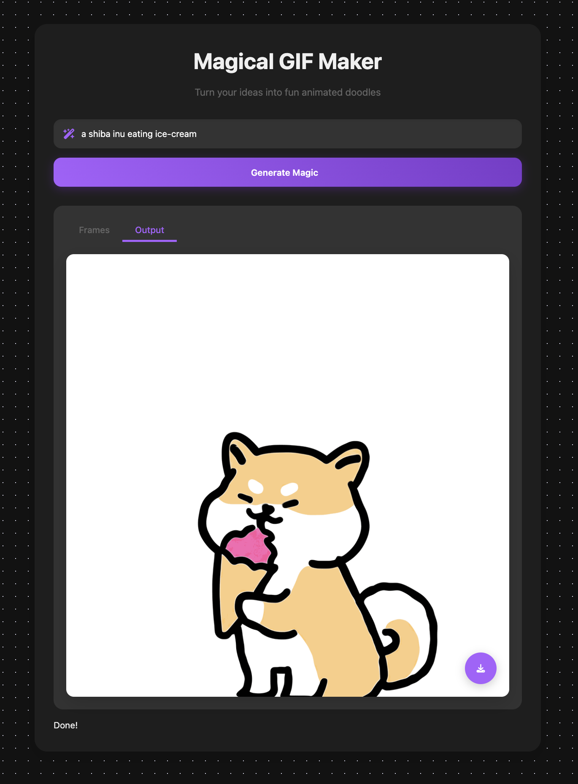

# 🎬 GIFMaker

Welcome to **GIFMaker AI Studio** – your one-stop solution for creating, editing, and sharing GIFs powered by AI! 🚀

---

## ✨ Features

- **AI-Powered GIF Creation:** Generate GIFs from text prompts using Gemini AI.
- **Edit & Customize:** Crop, resize, add captions, and apply filters to your GIFs.
- **Instant Preview:** See your GIFs update in real-time as you edit.
- **Easy Sharing:** Download or share your creations directly from the app.
- **Modern UI:** Responsive, intuitive, and beautiful interface.

---

## 🚀 Getting Started

### Prerequisites

- [Node.js](https://nodejs.org/) (v16 or higher recommended)
- A [Gemini API Key](https://ai.google.dev/)

### Installation

1. **Clone the repository**
   ```bash
   git clone https://github.com/your-username/gifmaker.git
   cd gifmaker
   ```

2. **Install dependencies**
   ```bash
   npm install
   ```

3. **Configure Environment Variables**

   Create a `.env.local` file in the root directory and add your Gemini API key:
   ```
   GEMINI_API_KEY=your-gemini-api-key-here
   ```

4. **Run the app locally**
   ```bash
   npm run dev
   ```

5. **Open in your browser**

   Visit [http://localhost:3000](http://localhost:3000) to start creating GIFs!

---

## 🖼️ Screenshots

<!-- Replace with your own screenshots -->
<p align="center">
  
  <br/>
  <em>Main interface of GIFMaker AI Studio</em>
</p>

---

## 📦 Project Structure

```
gifmaker/
├── components/      # React components
├── pages/           # Next.js pages
├── public/          # Static assets
├── styles/          # CSS/SCSS files
├── utils/           # Utility functions
├── .env.local       # Environment variables
└── ...
```

---

## 🛠️ Usage

- **Create GIF:** Enter a prompt and let the AI generate a GIF.
- **Edit GIF:** Use the built-in editor to tweak your GIF.
- **Download/Share:** Save your GIF or share it with friends.

---

## 🤝 Contributing

Contributions are welcome! Please open an issue or submit a pull request.

1. Fork the repo
2. Create your feature branch (`git checkout -b feature/YourFeature`)
3. Commit your changes (`git commit -am 'Add new feature'`)
4. Push to the branch (`git push origin feature/YourFeature`)
5. Open a Pull Request

---

## 📄 License

MIT License. See [LICENSE](LICENSE) for details.

---

## 🙋‍♂️ Support

For questions or feedback, open an issue or contact the maintainer.

---

<p align="center">
  <b>Made with ❤️ using AI</b>
</p>
