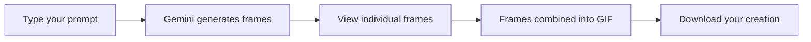

<!-- Badges -->
<p align="center">
  
  
  
</p>


<h1 align="center"> GIF Maker</h1>
<p align="center"><b>Turn your text prompts into charming animated doodles with Gemini AI!</b></p>

<div align="center">
  
</div>


---

## ✨ Features

<div align="center">

| 🧙‍♂️ | **AI-Powered Doodles** | Generate animated doodle GIFs from text using Gemini 2.0 |
|----|----------------------|----------------------------------------------------------|
| 🖼️ | **Frame-by-Frame**    | Watch the animation build with real-time frame generation |
| 🔄 | **Smooth Animation**  | Automatically creates smooth GIFs from generated frames   |
| 💾 | **Easy Download**     | Save your magical creations with one click                |
| 🎨 | **Beautiful UI**      | Clean, responsive interface with light/dark mode support  |

</div>

---


## 🌀 How it Works



</div>

---

## 🚀 Getting Started

### Prerequisites

- [Node.js](https://nodejs.org/) (v16 or higher)
- A [Gemini API Key](https://ai.google.dev/)

### Installation

```bash
git clone https://github.com/your-username/gifmaker.git
cd gifmaker
npm install
```

### Configuration

Create a `.env.local` file in the root directory and add your Gemini API key:

```env
GEMINI_API_KEY=your-gemini-api-key-here
```

### Run Locally

```bash
npm run dev
```

Open [http://localhost:3000](http://localhost:3000) in your browser to start creating GIFs!

---

## 🗂️ Actual Project Structure

```plaintext
gifmaker/
├── src/             # Source files
│   ├── index.tsx    # Main application code
│   └── index.css    # Styles
├── index.html       # HTML entry point
├── .env.local       # Environment variables for API key
├── vite.config.ts   # Vite configuration
├── tsconfig.json    # TypeScript configuration
├── package.json     # Dependencies and scripts
└── ...
```

---

## 🛠️ How to Use

<div align="center">
  <table>
    <tr>
      <td width="33%">
        
        <p align="center">Enter your creative prompt</p>
      </td>
      <td width="33%">
        
        <p align="center">Click "Generate Magic"</p>
      </td>
      <td width="33%">
        
        <p align="center">Download your GIF!</p>
      </td>
    </tr>
  </table>
</div>

### Example Prompts to Try

- "a cat playing with yarn"
- "a rocket launching into space"
- "a dolphin jumping through waves"
- "a dancing robot"

---

## 🧠 Tech Under the Hood

- **Gemini AI**: Powers the image generation with the `gemini-2.0-flash-preview-image-generation` model
- **gifenc**: Processes and combines frames into smooth GIFs
- **Vite**: Fast, modern frontend tooling

---

## 📄 License

CC0 1.0 Universal. See [LICENSE](LICENSE) for details.

---

## 🙋‍♂️ Support & Contribution

Got an idea or found a bug? Feel free to:
- Open an issue
- Submit a pull request
- Star the repository!

---

<p align="center">
  
  <br/>
  <b>Made with ✨ AI magic and human creativity</b>
</p>
